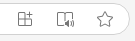
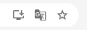

## Sobre esta edición digital.

Cada versículo y número de capítulo es un enlace que puedes copiar y compartir.

Los botones del lado inferior derecho son para cambiar el tamaño del texto y para abrir y cerrar la tabla de contenido.

<!-- Puedes colorear un numeral o hacerle anotaciones con el menú que aparece al darle doble click. Los versículos con anotaciones tendrán un delgado borde superior e inferior. -->

Algunos navegadores te permiten instalar este sitio como una aplicación aparte, pero la ubicación de esta opción varía. En navegador de escritorio, suele aparecer un ícono de descarga en la barra de dirección; en los siguientes dos ejemplos (Edge y Chrome) es el ícono de la izquierda:

   
   

Independientemente de si aparece o no el ícono de descarga en la barra de dirección, puede ser que la opción para instalar esté en algún lugar del menú; por ejemplo, en Edge está en:

`... > More Tools > Apps > Install`

En Brave para móvil está en:

`... > Add to Home screen > Install`

## Sobre nuestra labor.

Nuestra labor consiste en adaptar obras de doctrina católica a un formato digital fácil leer, navegar y referenciar, de manera que también estén conectadas entre sí. Por ejemplo, cuando nuestra versión digital del [Catecismo](https://materialknight.github.io/catechismus/) cita la [Didajé](https://materialknight.github.io/didache/) o la [Epístola a Diogneto](https://materialknight.github.io/epistula-ad-diognetum/), la referencia en el Catecismo es un enlace al pasaje correspondiente de esas obras. Nuestro fin es conectar de esa manera el Catecismo a todas sus fuentes. Si quisieras ayudarnos en esta gran tarea editorial, puedes hacerlo de 3 maneras:

1. Con tus oraciones.
2. Reportando cualquier error en el contenido o en el funcionamiento del sitio; en el pie de página está el perfil de GitHub con el repositorio de este sitio; ahí puedes enviarnos tu reporte o corrección.
3. Con una ofrenda por este medio:

   
   
3DgeHYTfif7Neg5eLVTNgxEPd2gSbq2Pzq

